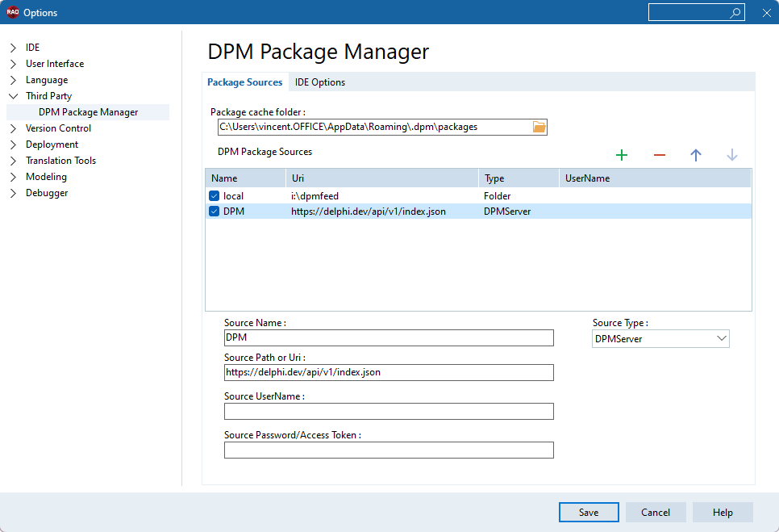

# Package Sources

A Package Source is either a folder or an HTTPS service which contains package files, and allows for searching, downloading or uploading of package files. When you first run dpm (either the command line or the ide integration), the default package source is added (https://delphi.dev/api/v1/index.json).

Multiple package sources can be defined, and they will be searched in the order they are defined. So when installing a package, if I don't specify a package version, each registered package source will be searched, and the highest version chosen. 

## Managing Package Sources

Package sources are listed in your [dpm.config](/concepts/config-files). 


**Adding a Package Source**

Adding a package source can be done from the command line, or from the IDE plugin options page (IDE options, Third Party\\DPM Package Manager).

```bat
dpm sources add -name=local -source=\\myserver\dpmsource
```


