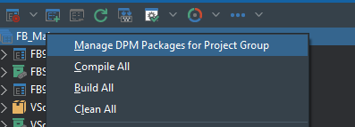
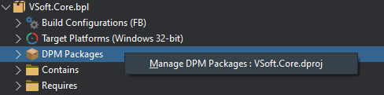
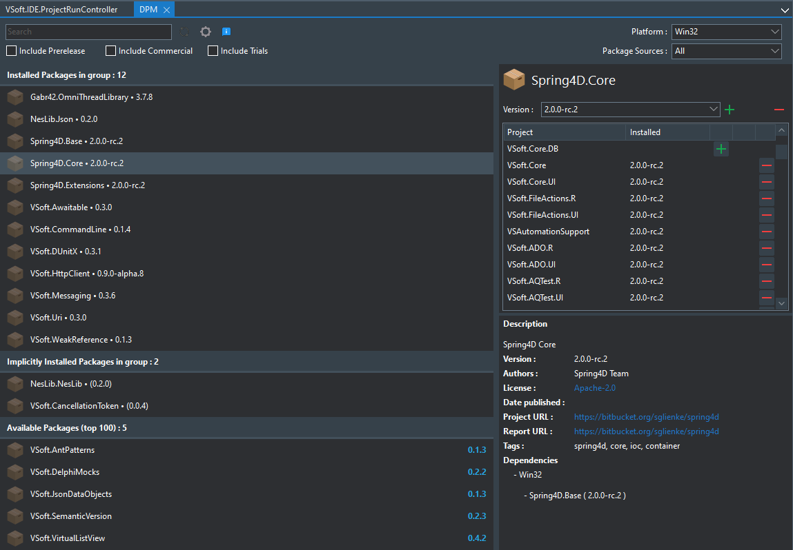

# IDE Integration

DPM IDE integration is accessed from the the Projects tree right click menu, by clicking on the Project Group node, or one of the project nodes, or the DPM Packages node for a project.

This will bring up a custom editor view

