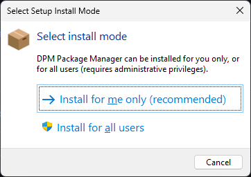

## Getting Started

Note that DPM is still very much alpha software, things are subject to change.

### Installing

Download the latest installer from github (it is codesigned, as are the dll's and command line exe) :

https://github.com/DelphiPackageManager/DPM/releases

The installer will prompt to install for the "me only" (recommended) or everyone (needs admin access for everyone).


Note that when installing "me only", the install path defaults to

```bat
C:\Users\[username]\AppData\Local\Programs\DPM Package Manager
```

This puts the install location under your user profile. If you change this you may run int permissions issues.

The installer will detect which supported versions of the Rad Studio IDE you have installed.

I recommended you leave the "add to path" option checked, it makes running the command line easier.

When you install packages, they will be downloaded from the package source to the package cache folder. By default the package cache folder will be in %APPDATA%\\.dpm\packages

You can change that by editing %APPDATA%\\.dpm\dpm.config and changing the packageCacheLocation setting.

To use DPM, you need some packages. The default package source is https://delphi.dev/api/v1/index.json - newer builds of dpm will add that by default.


You can either install packages from the command line, or using the IDE plugin. The IDE plugin adds a DPM node to each project in the project tree,
and a right click menu to "Manage DPM Packages". The DPM package view will open docked in the IDE code window, and show the list of installed packages, plus the first 100 packages
from the package sources. When you click on a package, the details on the right side of the view will show the package information and the projects which have the package installed.

Note that your dproj will be modified by installing packages.

DPM will :

a) Add some msbuild properties, and add a $(DPMSearch) variable to the base configuration project search path for each platform that you install for.
b) Add a DPM section at the bottom of the file with PackageReference elements, which record which packages are installed in the project.

Note that installing design time packages is not currently supported, I'm working on that still.

The rest of this post is for people that want to compile or contribute or create dpm packages.

### Creating packages

Create a dspec file - see the dspec files in the github projects linked above for examples. The docs are out a bit of date so use the source if you need a reference (Source\Core\Spec). If you get stuck just create a github issue.

There is now also a DspecCreator.exe included with the install which helps with creating dspec files. 

To generate the packages you need to run

`dpm pack My.Package.dspec -o=c:\mypackagefolder`

That will generate 1 file per compiler/platform combination.

### Building DPM

See [Contributing](../contributing.md)
